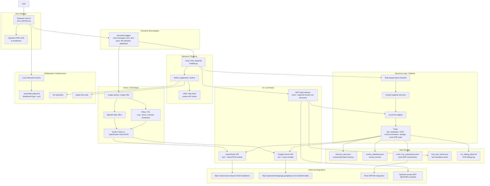
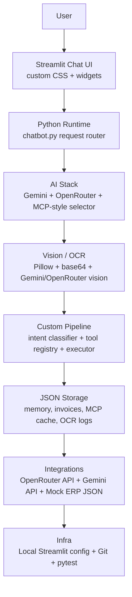

# Actual Technology Stack

This stack is based only on technologies detected in source imports, environment variable names, config files, API clients, tests, and project files. No package manifest, Dockerfile, cloud deployment config, or README was detected in the repository root.

## Stack Found

| Category | Detected Technologies | Evidence |
|---|---|---|
| Frontend / UI | Streamlit, custom HTML/CSS injected through `st.markdown` | `import streamlit as st` and Streamlit UI calls in `user_interface.py`; `<style>` block in `inject_styles()` |
| Backend / Runtime | Python, Streamlit app runtime, Python standard library HTTP clients | Python source files; `urllib.request`, `urllib.error`, `http.client` in API client modules |
| AI / LLM Layer | Google Gemini API, OpenRouter API, MCP-style local tool orchestration | `gemini_client.py`, `openrouter_client.py`, `GEMINI_*` and `OPENROUTER_*` env vars, `mcp/` package |
| Vision / OCR | Gemini Vision, OpenRouter vision/OCR models, Pillow/PIL image processing, base64 image encoding | `USE_GEMINI_VISION`, `GEMINI_VISION_MODEL`, `OPENROUTER_VISION_MODEL`, `from PIL import Image, ImageEnhance, ImageOps`, `vision_handler.py` |
| Data Storage | JSON files, local filesystem storage | `memory_store.json`, `invoice_database.json`, `mock_erp_submissions.json`, `mcp_tool_cache.json`, `ocr_debug_latest.txt` |
| AI Pipeline / Orchestration | Custom deterministic pipeline, rule-based intent classifier, local tool registry, tool execution, LLM-backed MCP selector | `pipeline/classifier.py`, `pipeline/executor.py`, `pipeline/registry.py`, `mcp/selector.py`, `mcp/orchestrator.py` |
| APIs / Integrations | OpenRouter chat completions API, Google Generative Language API, mock ERP JSON integration, optional remote MCP JSON-RPC discovery | API endpoints in `openrouter_client.py` and `gemini_client.py`; `tools/erp_tools.py`; `mcp/discovery.py` |
| Dev Tools | Git, pytest, Streamlit config, custom `.env` loader | `.git/`, `tests/` importing `pytest`, `.streamlit/config.toml`, `_load_env_file()` in clients |
| Deployment / Infra | Streamlit local runtime config only | `.streamlit/config.toml` with `[server] fileWatcherType = "poll"` |

## Not Detected

- React, Next.js, Node.js, Tailwind, FastAPI, Flask
- OpenAI SDK, Claude SDK, LangChain, LangGraph, Ollama
- OpenCV, Tesseract, EasyOCR
- PostgreSQL, MongoDB, SQLite, Redis
- Vector databases, embeddings pipeline, RAG chunking, retrieval, or reranking
- Authentication provider or login/signup system
- Docker, Docker Compose, Streamlit Cloud config, AWS, Azure, GCP, Render, HuggingFace Spaces
- Production monitoring or hosted logging service
- `requirements.txt`, `pyproject.toml`, `package.json`, `Pipfile`, or other dependency lock/config files

## Mermaid Diagram Code

## PPT-Friendly Simplified Version

## Why Each Technology Is Used

- **Streamlit**: Provides the chat interface, form handling, image upload widget, status/error display, and invoice database tables.
- **Custom HTML/CSS inside Streamlit**: Styles the chat shell, message area, top bar, composer, and database sections.
- **Python**: Main application language for UI glue, routing, LLM calls, image processing, invoice extraction, storage, and tests.
- **urllib / http.client**: Implements custom HTTP clients for Gemini, OpenRouter, and optional MCP discovery without a separate requests-based SDK.
- **Google Gemini API**: Used as the preferred text provider when `GEMINI_API_KEY` exists, and as a vision provider when `USE_GEMINI_VISION` is enabled.
- **OpenRouter API**: Used for text completions and fallback/primary vision-OCR model calls through the OpenRouter chat completions endpoint.
- **MCP-style orchestration**: Discovers tool metadata, caches tools, and can use an LLM selector to choose one active local tool for text-only requests.
- **Pillow / PIL**: Processes uploaded invoice images, including EXIF correction, cropping, resizing, contrast, and sharpness enhancement.
- **Base64 data URLs**: Converts uploaded images into inline payloads for vision model APIs.
- **Custom deterministic pipeline**: Classifies requests and runs the correct local tool sequence for QA, translation, OCR, invoice extraction, storage, and ERP push.
- **JSON file storage**: Persists chat/task memory, invoice records, mock ERP submissions, MCP tool metadata, and OCR debug output locally.
- **Mock ERP JSON integration**: Simulates invoice submission to an ERP system by writing accepted payloads to `mock_erp_submissions.json`.
- **pytest**: Provides the detected test framework for chatbot routing, pipeline behavior, storage, vision, MCP, and UI helper tests.
- **Git**: Version control is detected from the `.git` directory.
- **Streamlit config**: `.streamlit/config.toml` configures the local Streamlit server file watcher.

